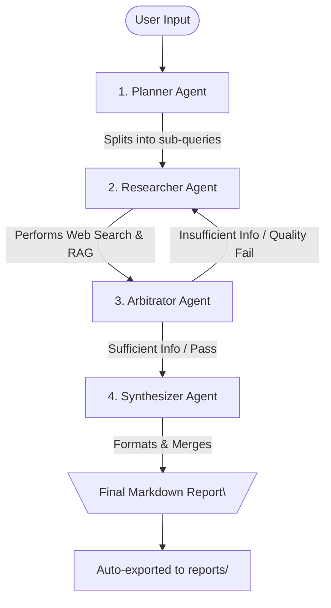

# ResearchMind 🧠

A multi-agent, self-correcting research pipeline built using LangGraph. ResearchMind automates complex web research by breaking down user queries, conducting parallel RAG-powered searches, checking information quality, and synthesizing a comprehensive final report.

---

## 🏗️ Multi-Agent Architecture

ResearchMind orchestrates four specialized agents to produce deep, high-quality reports:



1. **Planner Agent**: Analyzes a complex research topic and breaks it down into a list of specific sub-queries.
2. **Researcher Agent**: Takes sub-queries, executes targeted web searches, and processes pages using Retrieval-Augmented Generation (RAG).
3. **Arbitrator Agent**: Quality-checks the research results. If information is missing or inadequate, it requests the Researcher to retry with a modified query.
4. **Synthesizer Agent**: Compiles all verified research findings into a cohesive, high-quality, professional markdown report.

---

## ✨ Features

- 🔄 **LangGraph Orchestration**: Robust state machine structure managing loop-backs and state transitions.
- 🤖 **Specialized LLMs**: Custom agents tailored to specific tasks using Groq and Gemini models.
- 🌐 **Real-time Web Search**: Integrates web search APIs to fetch real-time knowledge.
- 🖥️ **Interactive Web Interface**: A modern single-page dashboard with real-time streaming of search steps using FastAPIs and WebSockets.
- 📄 **Exportable Reports**: Automatically saves final markdown reports into a local `reports/` folder.

---

## 🛠️ Local Setup Instructions

1. **Clone the Repository:**
   ```bash
   git clone https://github.com/samm-4/Research-Mind.git
   cd Research-Mind
   ```

2. **Create a virtual environment:**
   ```bash
   python -m venv myenv
   ```

3. **Activate the virtual environment:**
   - **Windows (PowerShell):**
     ```powershell
     myenv\Scripts\Activate.ps1
     ```
   - **Windows (CMD):**
     ```cmd
     myenv\Scripts\activate.bat
     ```
   - **Mac/Linux:**
     ```bash
     source myenv/bin/activate
     ```

4. **Install dependencies:**
   ```bash
   pip install -r requirements.txt
   ```

5. **Configure Environment Variables:**
   Copy `.env.example` to a new file named `.env` and fill in your API keys:
   ```env
   GROQ_API_KEY="your-groq-api-key"
   GEMINI_API_KEY="your-gemini-api-key"
   TAVILY_API_KEY="your-tavily-api-key"
   ```
---

## 🚀 How to Run

ResearchMind can be run in two modes:

### 1. Web UI (Interactive & Real-time)
Run the web application to see search agents executing queries live on a UI dashboard:
```bash
python frontend/app.py
```
This starts the FastAPI server and automatically opens `http://127.0.0.1:8000` in your web browser.

### 2. Terminal CLI (Simple CLI Output)
Run the terminal-based interface:
```bash
python main.py
```
Enter a research topic, watch the agents work, and view the final report directly in your console.

### 3. Pipeline Test Script
To run a fast integration test using a predefined battery volume expansion query:
```bash
python test_pipeline.py
```

---

## 📁 Project Structure

- `agents/` — Implementation of Planner, Researcher, Arbitrator, and Synthesizer agents.
- `core/` — LangGraph workspace definition (`graph.py`), environment config, and schemas.
- `frontend/` — FastAPI application serving the single-page HTML/JS/CSS web dashboard.
- `reports/` — Directory where generated reports are exported.
- `tools/` — Web search integrations and web-scraping utilities.
- `utils/` — Client code for interacting with LLM models.

